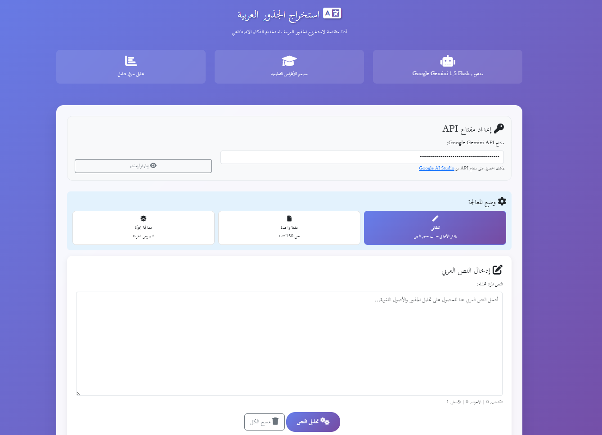

## Screenshots

### Main Interface


# Arabic Lemma Extractor

A powerful web-based tool for extracting Arabic lemmas (root forms) using Google's Gemini AI. This tool helps researchers, linguists, and Arabic language learners analyze Arabic text morphology by identifying the root forms of inflected words.

## 🌟 Features

- **AI-Powered Analysis**: Uses Google Gemini 1.5 Flash for accurate lemma extraction
- **Multiple Processing Modes**: 
  - Automatic mode (chooses best approach based on text length)
  - Single request mode (up to 150 words)
  - Chunked processing (for longer texts)
- **Comprehensive Results**: Displays tokens, lemmas, word types, and linguistic notes
- **Export Options**: JSON, CSV, and plain text formats
- **Real-time Statistics**: Total words, unique lemmas, and type distribution
- **Progress Tracking**: Visual progress bar for large text processing
- **Responsive Design**: Works on desktop and mobile devices
- **RTL Support**: Fully optimized for Arabic text display

## 🚀 Demo

Visit the live demo: https://mkarmouch.github.io/Arabic-Lemma-Extractor/

## 📋 Requirements

- Modern web browser with JavaScript enabled
- Google Gemini API key (free tier available)
- Internet connection for API calls

## ⚙️ Setup

### 1. Get a Google Gemini API Key

1. Visit [Google AI Studio](https://aistudio.google.com/app/apikey)
2. Sign in with your Google account
3. Create a new API key
4. Copy the API key for use in the application

### 2. Host the Application

#### Option A: GitHub Pages (Recommended)
1. Fork this repository
2. Go to Settings → Pages
3. Select "Deploy from a branch" → "main" → "/ (root)"
4. Your app will be available at `https://yourusername.github.io/arabic-lemma-extractor`

#### Option B: Local Development
1. Clone the repository:
   ```bash
   git clone https://github.com/yourusername/arabic-lemma-extractor.git
   cd arabic-lemma-extractor
   ```
2. Open `index.html` in your web browser

## 🎯 Usage

### Basic Usage

1. **Enter API Key**: Paste your Google Gemini API key in the designated field
2. **Choose Processing Mode**:
   - **Automatic**: Recommended for most users
   - **Single Request**: For texts up to 150 words
   - **Chunked Processing**: For longer texts (automatically splits into chunks)
3. **Input Arabic Text**: Enter or paste your Arabic text in the text area
4. **Analyze**: Click "تحليل النص" (Analyze Text) to start processing
5. **View Results**: Review the extracted lemmas, statistics, and linguistic analysis
6. **Export**: Download results in your preferred format (JSON, CSV, or text)

### Advanced Features

- **Progress Monitoring**: For large texts, monitor real-time progress
- **Stop Processing**: Cancel analysis at any time
- **Clear All**: Reset the application to start fresh
- **API Key Management**: Show/hide API key for security

## 📊 Output Format

### Results Table
- **الكلمة (Word)**: Original Arabic word from the text
- **الجذر (Lemma)**: Root form or lemma of the word
- **النوع (Type)**: Morphological category (V-I, N, VN, ADJ, PART, AMBIGUOUS)
- **ملاحظات (Notes)**: Additional linguistic information

### Statistics
- Total words processed
- Number of unique lemmas
- Distribution by word type
- Ambiguous words count

### Export Formats
- **JSON**: Structured data with full analysis details
- **CSV**: Spreadsheet-compatible format
- **Text**: Human-readable report

## 🔧 Technical Details

### Supported Word Types
- **V-I**: Verbs (Imperfect)
- **N**: Nouns
- **VN**: Verbal Nouns
- **ADJ**: Adjectives
- **PART**: Particles
- **AMBIGUOUS**: Words with multiple possible analyses

### API Configuration
- Model: Google Gemini 1.5 Flash
- Chunk size: 100 words per request
- Timeout: 30 seconds per request
- Retry attempts: 3 with exponential backoff

### Browser Compatibility
- Chrome 80+
- Firefox 75+
- Safari 13+
- Edge 80+

## 🛡️ Privacy & Security

- API keys are stored locally in your browser
- No data is sent to external servers except Google Gemini API
- All processing happens in your browser
- No user data is collected or stored by this application

## 🤝 Contributing

Contributions are welcome! Please feel free to submit a Pull Request. For major changes, please open an issue first to discuss what you would like to change.

### Development Guidelines
1. Maintain RTL text support
2. Follow existing code style
3. Test with various Arabic text inputs
4. Ensure mobile responsiveness
5. Update documentation as needed

## 📝 License

This project is licensed under the MIT License - see the [LICENSE](LICENSE) file for details.

## 🙏 Acknowledgments

- Google Gemini AI for providing the language model
- Bootstrap for the responsive UI framework
- Font Awesome for icons
- Arabic language community for testing and feedback

## 📞 Support

If you encounter any issues or have questions:

1. Check the [Issues](../../issues) page for existing solutions
2. Create a new issue with detailed information
3. Include sample text and error messages if applicable

## 🔮 Roadmap

- [ ] Support for additional Arabic dialects
- [ ] Batch file processing
- [ ] Advanced morphological analysis
- [ ] Integration with other NLP tools
- [ ] Offline processing capabilities
- [ ] API rate limiting optimization

## ⚠️ Limitations

- Requires internet connection for AI processing
- Google Gemini API has usage quotas
- Processing time depends on text length and API response time
- Accuracy depends on the complexity of Arabic text and context

---
